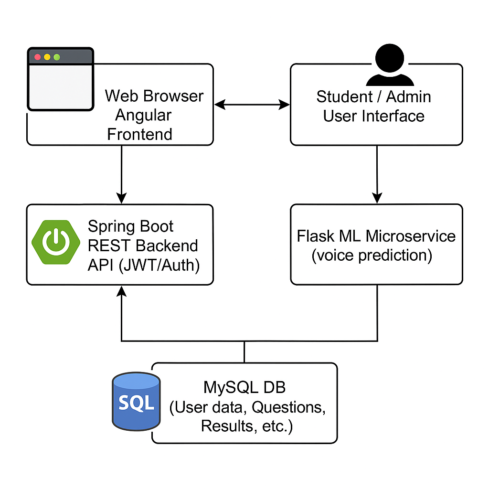
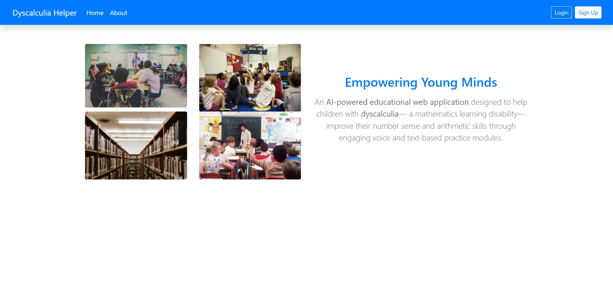
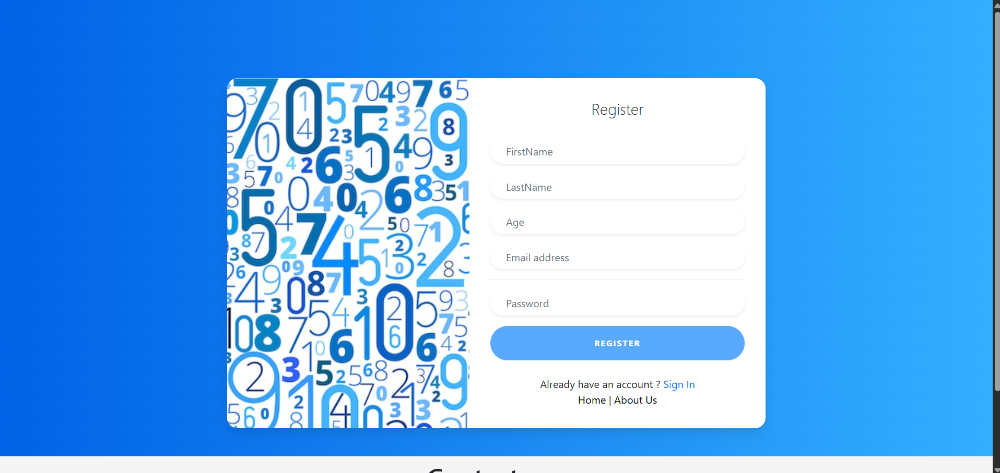
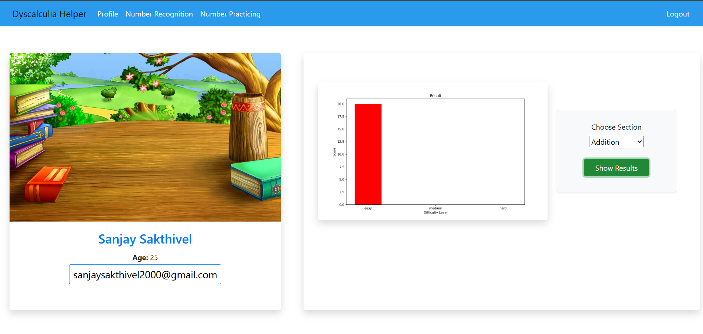
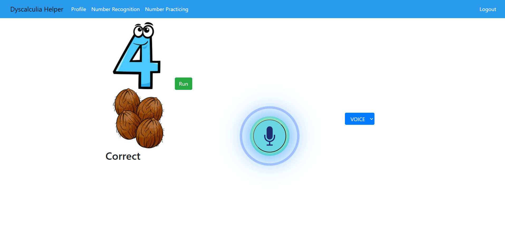
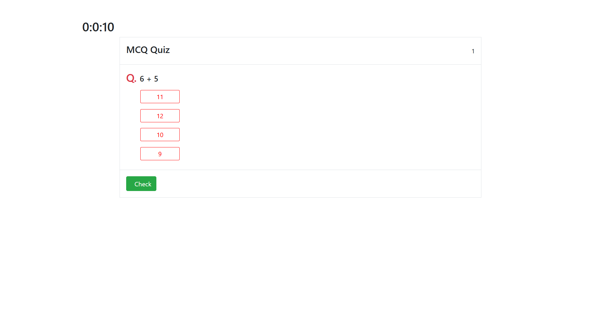

# Dyscalculia Helper App 🧠➗

An AI-powered educational web application designed to help children with dyscalculia— a mathematics learning disability—improve their number sense and arithmetic skills through engaging voice and text-based practice modules.

## 🎯 Project Overview

Children with dyscalculia struggle with basic number concepts, often finding it difficult to relate numerical values to their symbolic or spoken forms. The Dyscalculia Helper App addresses this issue by providing a structured environment where users can practice number recognition and arithmetic operations with real-time feedback and progress tracking.

> 🏆 Final Year Capstone Project  
> 🎓 B.E. in Computer Science, St. Joseph’s Institute of Technology, Chennai  
> 📅 July 2021

## 🧩 System Architecture
 

## 🔧 Tech Stack

### Frontend:
- **Angular 8** (Single Page Application)
- Responsive UI with components for:
  - Registration/Login
  - Number Practice
  - Voice & Text Input
  - Dashboard & Profile

### Backend:
- **Spring Boot** (Java) – REST APIs for user management, questions, results
- **Flask** (Python) – Machine Learning model for number recognition
- **MySQL** – Database for users, questions, results

### Machine Learning:
- **MFCC + CNN Model** for voice-based number recognition
- Trained using TensorFlow/Keras
- Audio input processed with `pydub` and predictions served via Flask API
  
 

## 🧠 Key Features

- 📣 **Voice-Based Number Recognition**
- 🔢 **Arithmetic Practice**: Addition, Subtraction, Multiplication
- 🧪 **Timed Tests** to measure speed and accuracy
- 📊 **Performance Dashboard** with visualized progress (via Matplotlib)
- 🔐 Secure authentication with Spring Security

## 🗂️ Modules Breakdown

### Backend (Spring Boot)
- `Controller` – API endpoints
- `Service / ServiceImpl` – Business logic
- `Entity` – JPA-based DB models
- `Repository` – DB access
- `Security` – JWT-based authentication & authorization

### Flask (ML)
- `keyword_spotting_service.py` – Model inference
- `train.py` – CNN training pipeline (MFCC features)
- `graph route` – Dynamic bar chart generation based on user progress

## 📸 Screenshots

### Home Page 
 
### SignIn
 
### Signup
 
### Dashboard

### Voice Mode
 
### Quiz   
 

## 🚀 Getting Started

### Prerequisites
- Node.js (14.20.0) + Angular CLI (npm -6.14.14)
- Java 11+
- Python 3.8+
- MySQL
- Redis (optional for caching)

### Setup Instructions

#### 1. Backend (Spring Boot)
```bash
cd BackEnd
./mvnw spring-boot:run
```

#### 2. ML Server (Flask)
```bash
cd flask
pip install -r requirements.txt
python server.py
```

#### 3. Frontend (Angular)
```bash
cd FrontEnd
npm install
ng serve
```

#### 4. Database (Mysql)
```sql
Run the scripts that are in the backend folder
```

## 📈 Future Improvements
- Integrate Spring AI for more advanced interaction
- Gamification and reward system for better engagement
- Progress tracking via weekly statistics and AI recommendations
- Mobile app version using Flutter

## 🤝 Authors
Sanjay Sakthivel (https://www.linkedin.com/in/sanjaysakthivel/)

Shelton Motha B (https://www.linkedin.com/in/shelton-motha-b-0501b4260/)

## License
This project is licensed under the MIT License.
